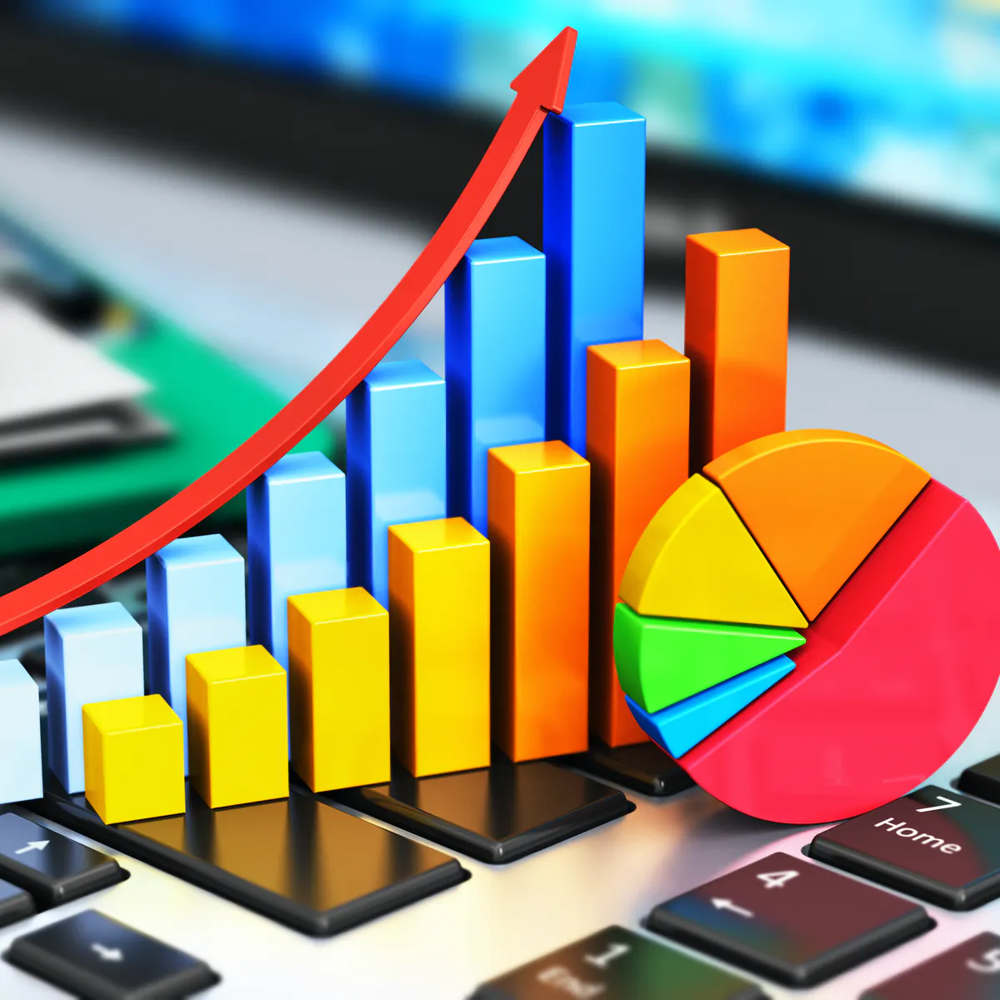
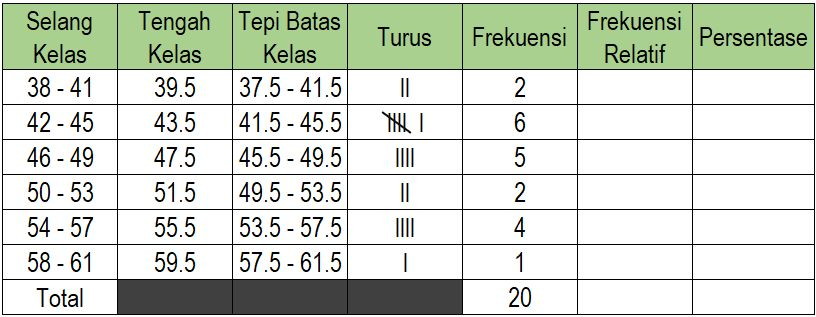
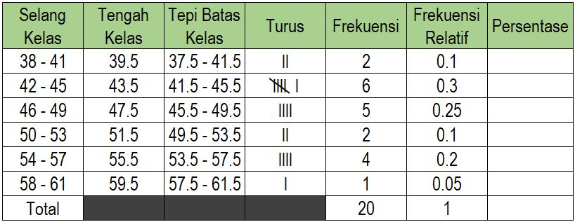

```{r xaringanExtra, echo=FALSE}
xaringanExtra::use_xaringan_extra(c("tile_view", "animate_css", "tachyons"))
```

```{r xaringan-panelset, echo=FALSE}
xaringanExtra::use_panelset()
```

```{r xaringan-scribble, echo=FALSE}
xaringanExtra::use_scribble()
```

```{r xaringan-logo, echo=FALSE}
xaringanExtra::use_logo(
  image_url = "Unsera.png"
)
```

```{r xaringanExtra-webcam, echo=FALSE}
xaringanExtra::use_webcam()
```

```{r xaringanExtra-search, echo=FALSE}
xaringanExtra::use_search(show_icon = TRUE)
```

.pull.center[
# **Outline**
]

---

.pull-left[


]

--
.pull-right[

<br><br><br><br><br><br><br><br><br>

# Bagaiamana cara .red[**penyajian**] datanya?


]

---

.pull.center[
# **Statistika Deskripsi dan Eksplorasi**
]

### Merupakan teknik .red[**penyajian**] dan .red[**peringkasan**] data sehingga menjadi informasi yang .purple[**mudah dipahami**]

.pull-left[
.pull.center[
# Teknik Penyajian
## 1. Tabel
## 2. Grafik
]
]

.pull-right[
.pull.center[
# Peringkasan Data
## 1. Ukuran Pemusatan
## 2. Ukuran Penyebaran
]
]

---

.pull-left[
<br><br>


]

.pull-right[

<br><br>
# **Outline**

# 1. Penyajian Data (Tabel)
# 2. Penyajian Data (Grafik)

]

---

.pull.center[
# **Penyajian Data**
]

.pull-left[
# Tabel
- Data Kualitatif (peubah kategorik)
- Data Kuantitatif (peubah numerik)
]

.pull-right[
#Grafik/Gambar
- Data Kualitatif (peubah kategorik)
  - Pie Chart
  - Bar Chart
- Data Kuantitatif
  - Histogram
  - Diagram Kotak Garis (Box Plot)

]

---

.pull-left[

]

.pull-right[
#**Penyajian Tabel**
Peubah **Jenis Kelamin** dan **Agama** merupakan peubah **kategorik**.

Penyajian data untuk peubah kategorik bisa menggunakan **Tabel Frekuensi**

**Tabel Frekuensi**
- Menyajikan data kualitatif (kategorik) dalam bentuk **frekuensi**
- Jika jumlah data mencukupi, tampilkan juga **persentase**-nya
]

---

.pull-left[

]

.pull-right[

## **Tabel Frekuensi**

Rekapitulasi berdasarkan **Agama**


<br><br>


Rekapitulasi berdasarkan **Jenis Kelamin**


]

---

.pull-left[

]

.pull-right[

##Bagaimana jika peubah **Agama** dan **Jenis Kelamin** dijadikan 1 tabel?

# Tabel Kontingensi

>### Digunakan untuk melihat distribusi dari dua data kategorik atau lebih


]

---

.pull-left[

]

.pull-right[
#**Penyajian Tabel**
Peubah **Tinggi** dan **Berat** merupakan peubah kuantitatif (**numerik**).

Penyajian data untuk peubah numerik bisa menggunakan **Tabel Distribusi Frekuensi Kelompok**

**Tabel Distribusi Frekuensi Kelompok**
- Digunakan untuk membuat pengelompokkan data kuantitatif
- Isi tabel terdiri dari selang kelas, frekuensi masing-masing kelas, frekuensi relatif masing-masing kelas

]

---

.pull-left[

]

.pull-right[
## **Cara membuat tabel distribusi frekuensi kelompok**

1. Tentukan jumlah kelas (Sturgis' rule ): $k=3.3 \log(n)+1$
1. Tentukan lebar kelas: $l=(X_{max}-X_{min})/k$
1. Tentukan batas atas dan batas bawah dari masing-masing kelas
1. Tentukan tepi batas kelas
1. List jumlah pengamatan pada masing-masing kelas
1. Frekuensi Relatif : cari proporsi dari masing-masing kelas

]

---

.pull-left[

]

.pull-right[
## **Tabel distribusi frekuensi kelompok untuk peubah .red[Berat]**

Jumlah Kelas:
$$\begin{align*}
k&=3.3 \log(n)+1 \\
&=3.3 \log(20)+1 \\
&=5.29 \approx 6
\end{align*}$$

Lebar Kelas:

$$\begin{align*}
l&=(X_{max}-X_{min})/k  \\
&=(58-40)/6             \\
&=3\approx 4
\end{align*}$$

]

---

.pull.center[

## **Tabel distribusi frekuensi kelompok untuk peubah .red[Berat]**

<br>


]

---

.pull.center[

## **Tabel distribusi frekuensi kelompok untuk peubah .red[Berat]**

<br>


]

---

.pull.center[

## **Tabel distribusi frekuensi kelompok untuk peubah .red[Berat]**

<br>



]

---

.pull.center[

## **Tabel distribusi frekuensi kelompok untuk peubah .red[Berat]**

<br>



]

---

.pull.center[

## **Tabel distribusi frekuensi kelompok untuk peubah .red[Berat]**

<br>


]

---

class: middle, center

# **Tugas Mandiri 1**
# **Buatlah tabel distribusi frekuensi kelompok untuk peubah .red[Tinggi]**

---

class: middle, center

# Bagaimana jika ingin menyajikan tabel yang berisi peubah .red[**kualitatif**] dan .red[**kuantitatif**] secara bersama-sama?

---

### Peubah kualitatif dan kuantitatif bisa disajikan secara bersama-sama menggunakan **Tabel Ringkasan**

- Menyajikan RINGKASAN STATISTIK yang memungkinkan.
- Ringkasan statistik yang digunakan adalah jumlah data, rataan (*mean*), standar deviasi, minimum, dan maksimum.
- Catatan: Hindarkan pemberian banyak informasi dalam kapasitas
yang terbatas


---

class: middle, center, inverse

# **Penyajian Grafik**

---

class: middle, center

background-image: url("gb_12.jpg")

---

.bg-washed-green.b--dark-green.ba.bw2.br3.shadow-5.ph4.mt5[

## Anda mendengar $\implies$ tahu
.pull.center[
## Anda membaca $\implies$ paham]
.pull.right[
## .red[Anda melihat] $\implies$ .red[percaya]
]
]

--

.pull.left[
- Grafik mengungkapkan banyak informasi dibandingkan dengan seribu kata-kata<br><br>
- Grafik yang disajikan harus dapat dimengerti oleh pembaca<br><br>
- Jika pembaca mempertanyakan apa maksudnya maka grafik yang disajikan “belum baik”<br><br>
- Gunakan “nalar” dalam membuat grafik.
]

---

.pull.center[
# **Penyajian Grafik**
]

.pull-left[

## Pie Chart (Diagram Lingkaran)

- ### Digunakan untuk menampilkan .red[**data kategorik**] khususnya .red[**data nominal**]
- ### Menunjukkan distribusi data dalam group (total 100%)
- ### Disajikan dalam bentuk %, terkadang perlu menyajikan pula jumlah data

]

.pull-right[
Data pada peubah **Agama** merupakan data kategorik (nominal), maka penyajian datanya bisa menggunakan *Pie Chart* (Diagram Lingkaran)


Peubah *Jenis Kelamin* juga bisa disajikan menggunakan diagram lingkaran karena berupa data kategorik (nominal).
]

---

.pull.center[
# **Penyajian Grafik**
]

.pull-left[
## Bar Chart (Diagram Batang)

- ### Berguna untuk menampilkan data kategorik
- ### Dapat pula digunakan untuk menyajikan data dari tabel kontingensi / tabel ringkasan data

]

.pull-right[

Data pada peubah **Agama** merupakan data kategorik (nominal), maka penyajian datanya bisa menggunakan *Bar Chart* (Diagram Batang)


]

---

.pull.center[
# **Penyajian Grafik**


]

---

.pull.center[
# **Penyajian Grafik**
]

## Peubah dengan tipe data numerik tidak bisa disajikan menggunakan Diagram Lingkaran ataupun Diagram Batang. Mengapa?

--

## Peubah dengan tipe data numerik bisa disajikan menggunakan:

.pull-left[
- ## Histogram
- ## Diagram Kotak Garis (Box Plot)
]

--

.pull-right[
- ## .green[Diagram Titik (Dot Plots)]
- ## .green[Diagram Dahan Daun (Stem and Leaf)]
]

---

.pull.center[
# **Penyajian Grafik**


]

## Histogram
- ###Sebuah grafik dari suatu sebaran frekuensi

--

- ###Bisa distribusi dari frekuensi-nya atau frekuensi relatif-nya

--

- ###Digunakan untuk melihat distribusi dari data:

--
    - ###Melihat ukuran penyebaran dan ukuran pemusatan data
    - ###Melihat adanya data outlier
    - ###Mendeteksi ada bimodus/tidak

---

.pull.center[
# **Penyajian Grafik**
]

### Histogram: .blue[Dapat digunakan untuk menentukan sebaran data]

.pull.center[

]

---

.pull.center[
# **Penyajian Grafik**


]

---

.pull.center[
# **Penyajian Grafik**
Histogram untuk peubah **Berat**


]

---

class: middle, center

# **Tugas Mandiri 2**
# **Buatlah histogram untuk peubah .red[Tinggi]**

---


